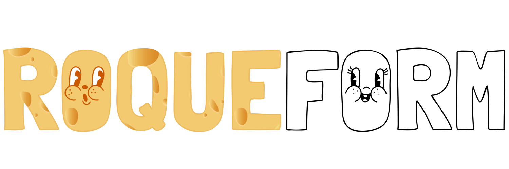

<p align="center">
  <a href="#readme">
    
  </a>
</p>

The form state management library that can handle hundreds of fields without breaking a sweat.

- Expressive and concise API with strict typings;
- Controlled and uncontrolled inputs;
- [Unparalleled extensibility with plugins;](#plugins-and-integrations)
- Supports your favourite rendering and [validation libraries;](#validation-scaffolding-plugin)
- [Just 2 kB gzipped.](https://bundlephobia.com/result?p=roqueform)

🔥&ensp;[**Try it on CodeSandbox**](https://codesandbox.io/s/2evfif)

```sh
npm install --save-prod roqueform
```

- [Plugins and integrations](#plugins-and-integrations)
- [Core features](#core-features)
- [Transient updates](#transient-updates)
- [Accessors](#accessors)
- [Authoring a plugin](#authoring-a-plugin)
- [Composing plugins](#composing-plugins)
- [Validation scaffolding plugin](#validation-scaffolding-plugin)
- [Motivation](#motivation)

# Plugins and integrations

- [react](./packages/react#readme)<br/>
  Hooks and components to integrate with React.

- [constraint-validation-plugin](./packages/constraint-validation-plugin#readme)<br/>
  Integrates fields with
  [Constraint validation API](https://developer.mozilla.org/en-US/docs/Web/API/Constraint_validation).

- [doubter-plugin](./packages/doubter-plugin#readme)<br/>
  Validates fields with [Doubter](https://github.com/smikhalevski/doubter#readme) shapes.

- [ref-plugin](./packages/ref-plugin#readme)<br/>
  Associates field with DOM elements.

- [reset-plugin](./packages/reset-plugin#readme)<br/>
  Manages field initial value and dirty status.

- [scroll-to-error-plugin](./packages/scroll-to-error-plugin#readme)<br/>
  Enables scrolling to a field that has an associated validation error. Works with any validation plugin in this repo.

- [uncontrolled-plugin](./packages/uncontrolled-plugin#readme)<br/>
  Updates fields by listening to change events of associated DOM elements.

- [zod-plugin](./packages/zod-plugin#readme)<br/>
  Validates fields with [Zod](https://zod.dev/) schemas.

# Core features

Roqueform core features are framework-agnostic since they don't rely on the rendering process. The central piece of
Roqueform is the concept of a field. A field holds a value and provides a means to update it. Let's start by creating a
field:

```ts
import { createField } from 'roqueform';

const field = createField();
// ⮕ Field<any>
```

A value can be set to and retrieved from the field:

```ts
field.setValue('Pluto');

field.value;
// ⮕ 'Pluto'
```

Provide the initial value for a field:

```ts
const ageField = createField(42);
// ⮕ Field<number>

ageField.value;
// ⮕ 42
```

The field value type is inferred from the initial value, but you can explicitly specify the field value type:

```ts
interface Planet {
  name: string;
}

const universeField = createField<{ planets?: Planet[] }>();
// ⮕ Field<{ planets?: Planet[] } | undefined>

universeField.value;
// ⮕ undefined
```

Derive a new field from the existing one:

```ts
const planetsField = universeField.at('planets');
// ⮕ Field<Planet[] | undefined>
```

`planetsField` is a child field, and it is linked to its parent `universeField`.

```ts
planetsField.key;
// ⮕ 'planets'

planetsField.parent;
// ⮕ universeField
```

Fields returned by the [`at`](https://smikhalevski.github.io/roqueform/interfaces/roqueform.Field.html#at) method have a
stable identity. This means that you can invoke `at` with the same key multiple times and the same field instance is
returned:

```ts
universeField.at('planets');
// ⮕ planetsField
```

So most of the time you don't need to store a child field in a variable if you already have a reference to a parent
field.

The child field has all the same functionality as its parent, so you can derive a new field from it as well:

```ts
planetsField.at(0).at('name');
// ⮕ Field<string>
```

When a value is set to a child field, a parent field value is also updated. If parent field doesn't have a value yet,
Roqueform would infer its type from on the child field key.

```ts
universeField.value;
// ⮕ undefined

universeField.at('planets').at(0).at('name').setValue('Mars');

universeField.value;
// ⮕ { planets: [{ name: 'Mars' }] }
```

By default, for a string key a parent object is created, and for a number key a parent array is created. You can change
this behaviour with [custom accessors](#accessors).

When a value is set to a parent field, child fields are also updated:

```ts
const nameField = universeField.at('planets').at(0).at('name');

nameField.value;
// ⮕ 'Mars'

universeField.setValue({ planets: [{ name: 'Venus' }] });

nameField.value;
// ⮕ 'Venus'
```

# Subscriptions

You can subscribe a subscriber to a field updates. The returned callback would unsubscribe the subscriber.

```ts
const unsubscribe = planetsField.on('*', (updatedField, currentField) => {
  // Handle the update
});
// ⮕ () => void
```

Subscribers are called with two arguments:

<dl>
<dt><code>updatedField</code></dt>
<dd>

The field that initiated the update. In this example it can be `planetsField` itself, any of its child fields, or any
of its ancestor fields.

</dd>
<dt><code>currentField</code></dt>
<dd>

The field to which the subscriber is subscribed. In this example it is `planetsField`.

</dd>
</dl>

Subscribers are called when a field value is changed or [when a plugin mutates the field object](#authoring-a-plugin).
The root field and all child fields are updated before subscribers are called, so it's safe to read field values in a
subscriber.

Fields use [SameValueZero](https://262.ecma-international.org/7.0/#sec-samevaluezero) comparison to detect that the
value has changed.

```ts
planetsField.at(0).at('name').on('*', subscriber);

// ✅ The subscriber is called
planetsField.at(0).at('name').setValue('Mercury');

// 🚫 Value is unchanged, the subscriber isn't called
planetsField.at(0).setValue({ name: 'Mercury' });
```

# Transient updates

When you call [`setValue`](https://smikhalevski.github.io/roqueform/interfaces/roqueform.Field.html#setValue) on a field
then subscribers of its ancestors and its updated child fields are triggered. To manually control the update propagation
to fields ancestors, you can use transient updates.

When a value of a child field is set transiently, values of its ancestors _aren't_ immediately updated.

```ts
const avatarField = createField();

avatarField.at('eyeColor').setTransientValue('green');

avatarField.at('eyeColor').value;
// ⮕ 'green'

// 🟡 Parent value wasn't updated
avatarField.value;
// ⮕ undefined
```

You can check that a field is in a transient state:

```ts
avatarField.at('eyeColor').isTransient;
// ⮕ true
```

To propagate the transient value contained by the child field to its parent, use
the [`dispatch`](https://smikhalevski.github.io/roqueform/interfaces/roqueform.Field.html#dispatch) method:

```ts
avatarField.at('eyeColor').dispatch();

avatarField.value;
// ⮕ { eyeColor: 'green' }
```

`setTransientValue` can be called multiple times, but only the most recent update is propagated to the parent field
after the `dispatch` call.

When a child field is in a transient state, its value as observed from the parent may differ from the actual value:

```ts
const planetsField = createField(['Mars', 'Pluto']);

planetsField.at(1).setTransientValue('Venus');

planetsField.value[1];
// ⮕ 'Pluto'

// 🟡 Transient value is different
planetsField.at(1).value;
// ⮕ 'Venus'
```

Values are synchronized after the update is dispatched:

```ts
planetsField.at(1).disaptch();

planetsField.value[1];
// ⮕ 'Venus'

planetsField.at(1).value;
// ⮕ 'Venus'
```

# Accessors

[`ValueAccessor`](https://smikhalevski.github.io/roqueform/interfaces/roqueform.Accessor.html) creates, reads and updates
field values.

- When the new field is child via
  [`Field.at`](https://smikhalevski.github.io/roqueform/interfaces/roqueform.Field.html#at) method, the field value is
  read from the value of the parent field using the
  [`ValueAccessor.get`](https://smikhalevski.github.io/roqueform/interfaces/roqueform.Accessor.html#get) method.

- When a field value is updated via
  [`Field.setValue`](https://smikhalevski.github.io/roqueform/interfaces/roqueform.Field.html#setValue), then the parent
  field value is updated with the value returned from the
  [`ValueAccessor.set`](https://smikhalevski.github.io/roqueform/interfaces/roqueform.Accessor.html#set) method. If the
  updated field has child fields, their values are updated with values returned from the
  [`ValueAccessor.get`](https://smikhalevski.github.io/roqueform/interfaces/roqueform.Accessor.html#get) method.

You can explicitly provide a custom accessor along with the initial value. Be default, Roqueform uses
[`naturalValueAccessor`](https://smikhalevski.github.io/roqueform/variables/roqueform.naturalValueAccessor.html):

```ts
import { createField, naturalValueAccessor } from 'roqueform';

const field = createField(['Mars', 'Venus'], naturalValueAccessor);
```

`naturalValueAccessor` supports plain object, array, `Map`-like, and `Set`-like instances.

If the field value object has `add` and `Symbol.iterator` methods, it is treated as a `Set`:

```ts
const usersField = createField(new Set(['Bill', 'Rich']));

usersField.at(0).value;
// ⮕ 'Bill'

usersField.at(1).value;
// ⮕ 'Rich'
```

If the field value object has `get` and `set` methods, it is treated as a `Map`:

```ts
const planetsField = createField(new Map([
  ['red', 'Mars'],
  ['green', 'Earth']
]));

planetsField.at('red').value;
// ⮕ 'Mars'

planetsField.at('green').value;
// ⮕ 'Earth'
```

When the field is updated, a parent field value is inferred from the key: for a positive integer key a parent array is
created, otherwise, an object is created.

```ts
const carsField = createField();

carsField.at(0).at('brand').setValue('Ford');

carsField.value;
// ⮕ [{ brand: 'Ford' }]
```

# Authoring a plugin

Plugin is a function that receives a field instance, an accessor, and a callback to notify the field subscribers about
changes. To illustrate how plugins work, let's create a simple plugin that enriches a field with a DOM element
reference.

```ts
import { Plugin } from 'roqueform';

const elementPlugin: Plugin<{ element: Element | null }> = field => {
  field.element = null;
};
```

> [!IMPORTANT]\
> The plugin function directly mutates the field instance. This is required since multiple plugins may be updating the
> same field and may need to share the same field identity.

To apply the plugin to a field, pass it to the field factory:

```ts
const planetField = createField({ name: 'Mars' }, elementPlugin);
// ⮕ Field<{ name: string }, { element: Element | null }>

planetField.element;
// ⮕ null
```

The plugin would be called for each child field when it is first accessed:

```ts
planetField.at('name').element
// ⮕ null
```

We can now assign a DOM element reference to an `element` property, so we can later access an element through a field.
But with the current implementation, there's no way to notify field consumers that the value of the `element` property
has changed. Let's update the plugin implementation to trigger subscribers.

```ts
import { Plugin } from 'roqueform';

interface ElementPlugin {

  readonly element: Element | null;

  setElement(element: Element | null): void;
}

const elementPlugin: Plugin<ElementPlugin> = (field, accessor, notify) => {
  field.element = null;

  field.setElement = element => {
    field.element = element;
    
    // 🟡 Synchronously triggers subscribers
    notify();
  };
};
```

Now when `setElement` is called on a field, its subscribers would be invoked.

```ts
const planetField = createField({ name: 'Mars' }, elementPlugin);

planetField.at('name').on('*', (updatedField, currentField) => {
  // Handle the update
  currentField.element;
  // ⮕ document.body
});

planetField.at('name').setElement(document.body);
```

# Composing plugins

To combine multiple plugins into a single function, use the
[`composePlugins`](https://smikhalevski.github.io/roqueform/variables/roqueform.composePlugins.html) helper:

```ts
import { createField, composePlugins } from 'roqueform';

createField(['Mars'], composePlugins(plugin1, plugin2));
// ⮕ Field<string[], …>
```

# Validation scaffolding plugin

Roqueform a shipped with validation scaffolding plugin
[`validatePlugin`](https://smikhalevski.github.io/roqueform/variables/roqueform.validatePlugin.html), so you can build
your validation on top of it.

> [!NOTE]\
> This plugin provides a low-level functionality. Prefer [constraint-validation-plugin](#plugins-and-integrations),
> [doubter-plugin](#plugins-and-integrations), or [zod-plugin](#plugins-and-integrations) or other high-level
> validation plugin.

```ts
import { validationPlugin } from 'roqueform';

const plugin = validationPlugin((field, addError) => {
  if (!field.at('name').value) {
    addError(field.at('name'), 'Name must not be empty');
  }
});

const userField = createField({ name: '' }, plugin);

userField.validate();
// ⮕ ['Name must not be empty']

userField.error;
// ⮕ null

userField.at('name').error;
// ⮕ 'Name must not be empty'
```

This plugin does all the heavy lifting related to field updates, manual validation error management, async validation
abortions, etc. The plugin takes a validator callback, or an object that has a `validate` method and an optional
`validateAsync` method. The validator receives a field that must be validated and a `addError` callback that tells
Roqueform that an error should be associated with a particular field.

You can manually associate an error with a filed:

```ts
// Manually associate an error for a field
userField.addError('Some useful message');

userField.error;
// ⮕ 'Some useful message'
```

`validatePlugin` distinguishes errors set via the `addError` callback passed to a plugin, and errors set via the
[`Field.addError`](https://smikhalevski.github.io/roqueform/interfaces/roqueform.Field.html#setError) method.
Errors set via the `addError` callback are automatically cleared when the `validate` or `validateAsync` methods are
called. Errors set via the
[`addError`](https://smikhalevski.github.io/roqueform/interfaces/roqueform.Field.html#setError) method are preserved as
is, and you should explicitly call `clearErrors` delete them.

```ts
userField.clearErrors({ recursive: true });
```

# Motivation

Roqueform was built to satisfy the following requirements:

- Since the form lifecycle consists of separate phases (input, validate, display errors, and submit), the form state
  management library should allow to tap in (or at least not constrain the ability to do so) at any particular phase to 
  tweak the data flow.

- Form data should be statically and strictly typed up to the very field value setter. So there must be a compilation
  error if the string value from the silly input is assigned to the number-typed value in the form state object.

- **Use the platform!** The form state management library must not constrain the use of the `form` submit behavior,
  browser-based validation, and other related native features.

- There should be no restrictions on how and when the form input is submitted because data submission is generally
  an application-specific process.

- There are many approaches to validation, and a great number of awesome validation libraries. The form library must
  be agnostic to where (client-side, server-side, or both), how (on a field or on a form level), and when (sync, or
  async) the validation is handled.

- Validation errors aren't standardized, so an arbitrary error object shape must be allowed and related typings must be
  seamlessly propagated to the error consumers/renderers.

- The library API must be simple and easily extensible.
